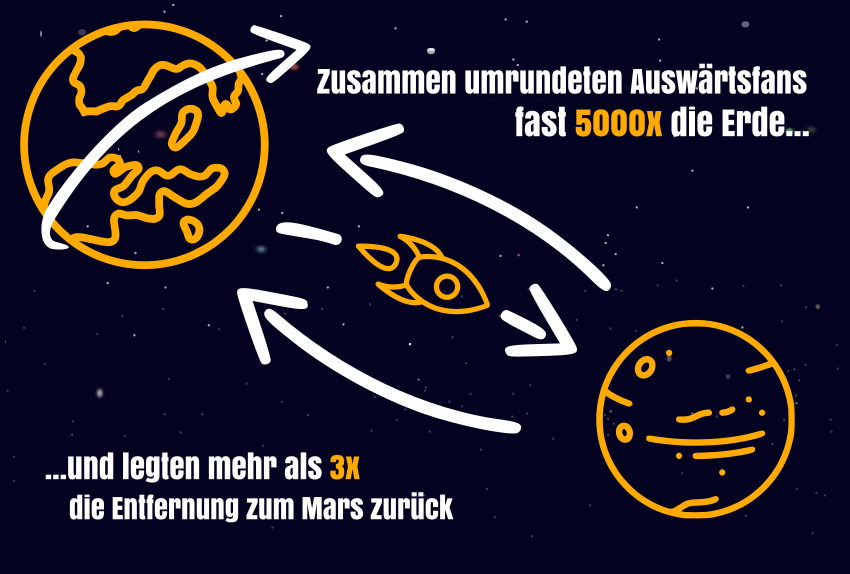
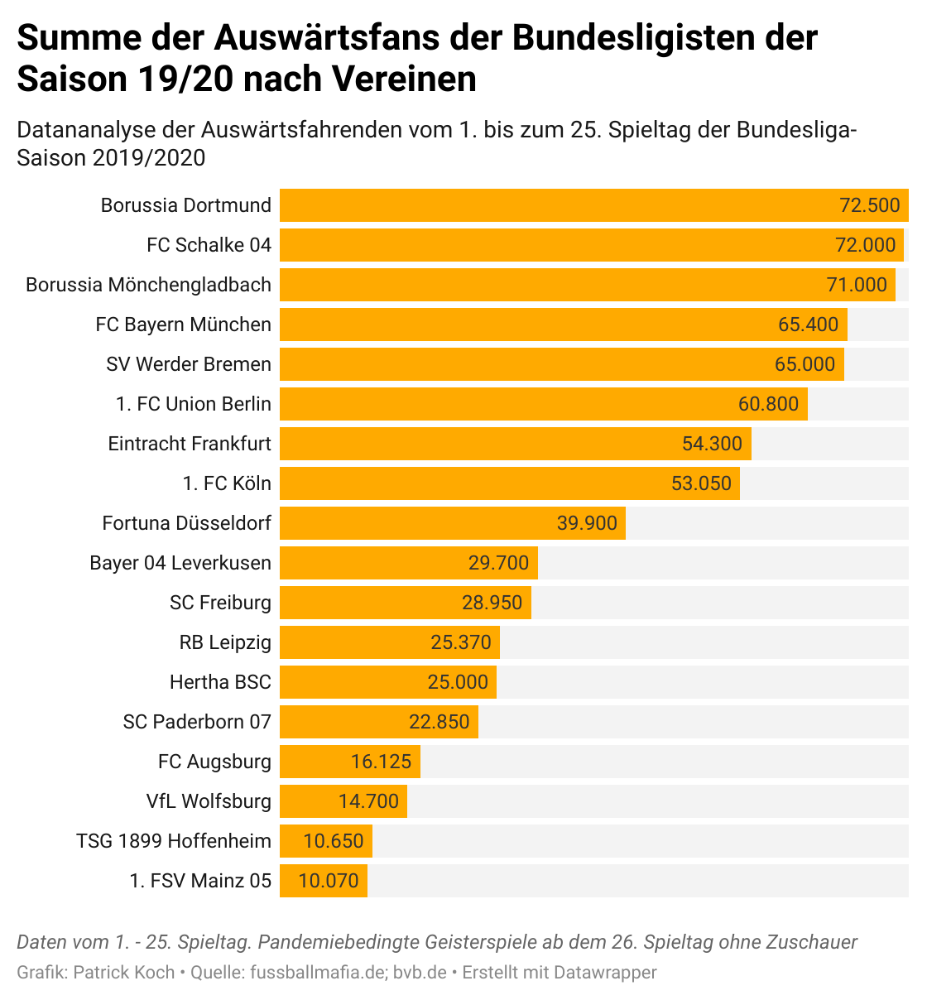

# Away fans analysis of the Bundesliga season 19/20
An analysis of away fans of the Bundesliga teams in the 19/20 season in an interactive graphic.
This project is a simple website that calculates and visualizes the distances traveled by football teams in the 2019/2020 season for away matches. It provides an interface to explore the travel distances of various clubs and compare their travel efforts.

[Show on Datawrapper.de](https://datawrapper.dwcdn.net/WCzlu/1/)

## Features

- **Distance Visualization:** Displays the total distance traveled for away matches in kilometers.
- **Interactive Map:** Visualizes the traveled routes on an interactive map for better understanding.
- **Click on the Bubbles:** Click on the bubbles to get a deeper view inside the data.

## How to Use

1. Visit the live site: [Away fans analysis of the Bundesliga season 19/20](https://pkoch12.github.io/auswaertskilometer_19-20/).
2. Click on the Play-Button and see the animation
3. Hit the button again to stop the visualization on the preferred matchday
4. Klick on the bubbles to get detailed information about the away-fans
5. View the calculated distance and the corresponding route on the map.

## Technology Stack

- **HTML, CSS, JavaScript:** The core technologies used for building the website.
- **Leaflet.js:** A lightweight JavaScript library used for rendering interactive maps.
- **OpenStreetMap:** Provides the map tiles for the visual representation.
- **GitHub Pages:** Used for hosting the website.

## Purpose

This project serves as a fun and interactive way for football fans to learn more about the travel efforts of their favorite teams during the 2019/2020 season. It also demonstrates how to integrate mapping libraries with JavaScript for data visualization.

## Limitations

The calculation is based on the assumption that all fans have traveled the distance from the home stadium to the away stadium. To simplify matters, the analysis also shows the distance as the crow fly distance from the home stadium to the away stadium.

Due to the pandemic and the associated ghost matches (matches without fans), only Matchdays 1 - 25 were taken into account.

The data is based on information from [fussballmafia.de](fussballmafia.de). The data has not been verified by third parties.

## License

This project is licensed under the [MIT License](js/LICENSE).

---

Enjoy exploring the travel distances of your favorite football teams!
